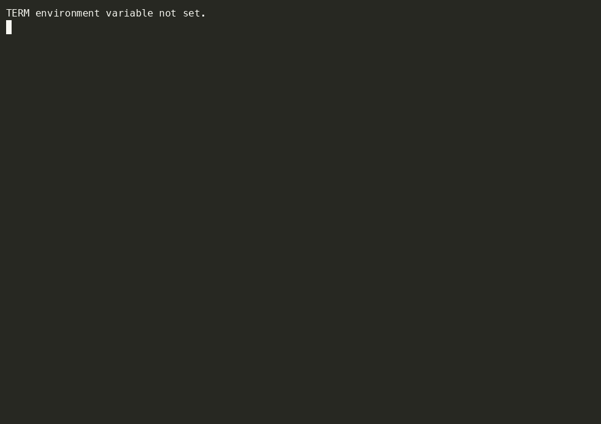

# Bad Apple — live demo

A sovereign personal AGI organism — local, owner-keyed, provable.

In ~60 seconds: she answers who she is, a peer witness pins her history, her two brains vote on a motion and the dissent is preserved signed, her immune system flags an injection attempt, she certifies that a datum never occurred in her history, and issues a signed compute IOU — then every record verifies offline.

- The organism: [github.com/savageAZfck/Bad_Apple](https://github.com/savageAZfck/Bad_Apple)
- The organs: [crates.io/users/savageAZfck](https://crates.io/users/savageAZfck)
- Organs shown: `kola-witness` · `bicameral` · `nagual` · `tabula-rasa` · `potlatch`

`demo.cast` is the raw asciinema recording — replay it with `asciinema play demo.cast`.
